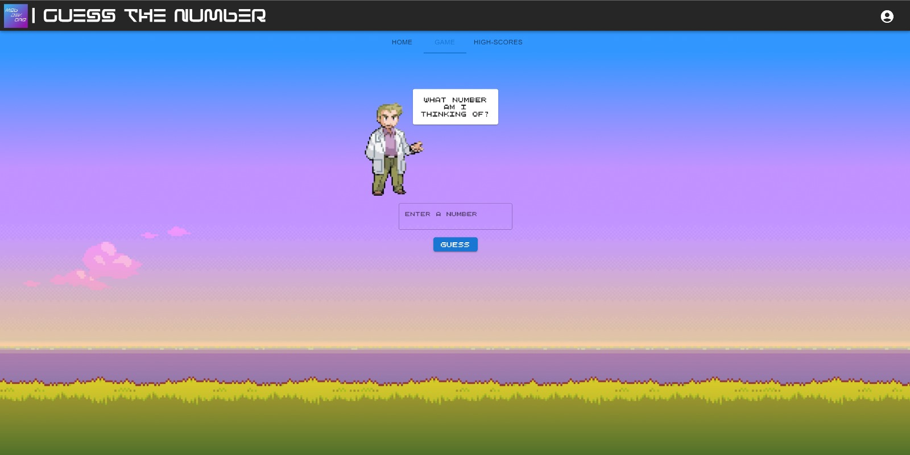

# Guess-The-Number Game by MobDevOne

Welcome to the Guess-The-Number game project by Team MobDevOne! This game is designed as a school project to test your number-guessing skills. The computer will randomly select a number between 0 and 100, and your task is to guess that number.

 <!-- Replace with a gameplay demo GIF or image -->

## Gameplay Rules

- The computer selects a random whole number between 0 and 100.
- You, the player, need to guess the chosen number.
- After each guess, the computer will provide feedback whether your guess is too high or too low.
- Your player name and the number of attempts will be stored in a database.
- The leaderboard with player names and their attempt counts will be displayed at the beginning and end of each game.

## How to Play

Welcome to the Guess the Number! This simple yet exciting game challenges you to use your deduction skills to guess a hidden number within a specified range. Follow the steps below to start playing:

## Game Objective

The objective of the game is to correctly guess the hidden number within the fewest attempts possible. With each guess, you will receive feedback on whether your guess is too high or too low, helping you narrow down the possible numbers.

## Game Setup

Before you start playing, make sure you have the game interface open on your device. Here's how to get started:

1. **Launch the Game**: Open your web browser and navigate to the game's URL.

2. **Create an Account (Optional)**: If it's your first time playing, you may be prompted to create an account by entering a username and password. This step is optional but allows you to track your high scores and achievements.

## Gameplay

Once you've set up the game, it's time to start guessing the hidden number! Here's how to play:

1. **Guess the Number**: In the game interface, you will see a text input field labeled "Enter a number." This is where you'll enter your guesses.

2. **Enter Your Guess**: Type a number into the input field and press the "Guess" button to submit your guess. You can also press the "Enter" key on your keyboard after entering your guess.

3. **Receive Feedback**: After each guess, the game will provide feedback on whether your guess is too high or too low compared to the hidden number. Use this feedback to adjust your next guess.

4. **Keep Guessing**: Repeat steps 2 and 3 until you correctly guess the hidden number.

## Winning the Game

Congratulations! You've won the game when you successfully guess the hidden number. Here's what happens when you win:

- You'll receive a "Congratulations" message.

- The game will display the hidden number you guessed.

- You'll see the number of attempts it took you to guess correctly.

## Options After Winning

After winning the game, you have two options:

1. **Play Again**: If you'd like to test your skills again, simply click the "Play Again" button. This will start a new game session with a different hidden number.

2. **View High Scores**: Curious to see how your performance compares to other players? Click the "High Scores" button to view the leaderboard and see where you rank.

## About the Game

Want to learn more about the "Guess the Number" game and the team behind it? Click the "About" option in the game menu to access information about the project, its developers, and key features.

## Tips and Strategies

To improve your chances of winning, consider these tips:

- **Start in the Middle**: Begin your guesses near the middle of the number range. This strategy can help you quickly narrow down the possibilities.

- **Use Feedback**: Pay close attention to the feedback provided after each guess. It can guide your next guess and help you make informed choices.

- **Track Your Attempts**: Keep track of the numbers you've guessed and the corresponding feedback. This can help you make more strategic guesses.

## Have Fun!

The "Guess the Number" game is all about having fun while testing your deduction skills. Whether you're playing for a few minutes or aiming for the top of the leaderboard, enjoy the challenge and excitement of guessing the hidden number. Good luck, and may you guess right on your first try!

## About

About Our "Guess the Number" School Project
Welcome to the About page of our school project, "Guess the Number," by our Team MobDevOne.

This project was developed as part of our school curriculum to demonstrate our programming and problem-solving skills. 
The "Guess the Number" game is a classic and fun game that challenges players to guess a randomly generated number within a certain range.

Key features of our project include:
- Random number generation within the range of 1 - 100.
- User-friendly interface with clear instructions.
- Feedback to let players know if their guess is too high or too low.
- Score tracking to record the number of attempts taken to guess the correct number.

We hope you enjoy playing our "Guess the Number" game and find it both entertaining and challenging. Thank you for visiting our project's About page!
